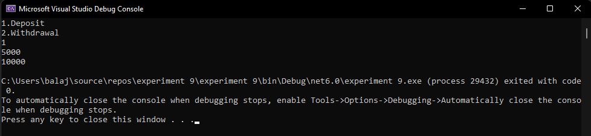

# Interface

## Aim:
To write a C# program using interface concept
## Algorithm:
### Step 1:
Create an Interface.

### Step 2:
Create a child class.

### Step 3:
Declare 2 functions deposit() and withdrawal() as abstract methods in the interface.

### Step 4:
Create those 2 functions in the child class and perform respective operation.

### Step 5:
Use while loop and and switch case to Get the choice from the user whether to perform withdrawal or deposit operation.

### Step 6:
After perform the functions to display the remaining balance of the user.

## Program:
```
using System;
public interface bank
{
    void deposit(int amount);
    void withdrawal(int amount);
}
public class bankex : bank
{
    int balance = 5000;
    int amount;
    public void deposit(int amount)
    {
        balance += amount;
        Console.WriteLine(balance);
    }
    public void withdrawal(int amount)
    {
        balance -= amount;
        Console.WriteLine(balance);
    }
}
public class hello
{
    public static void Main(string[] args)
    {
        bankex obj = new bankex();
        Console.WriteLine("1.Deposit\n2.Withdrawal");
        int ch = Convert.ToInt32(Console.ReadLine());
        if (ch == 1)
        {
            int amount = Convert.ToInt32(Console.ReadLine());
            obj.deposit(amount);
        }
        else if(ch == 2)
        {
            int amount = Convert.ToInt32(Console.ReadLine());
            obj.withdrawal(amount);
        }

    }
}


```

## Output:


## Result:
Thus to write a C# program using interface concept is executed successfully.